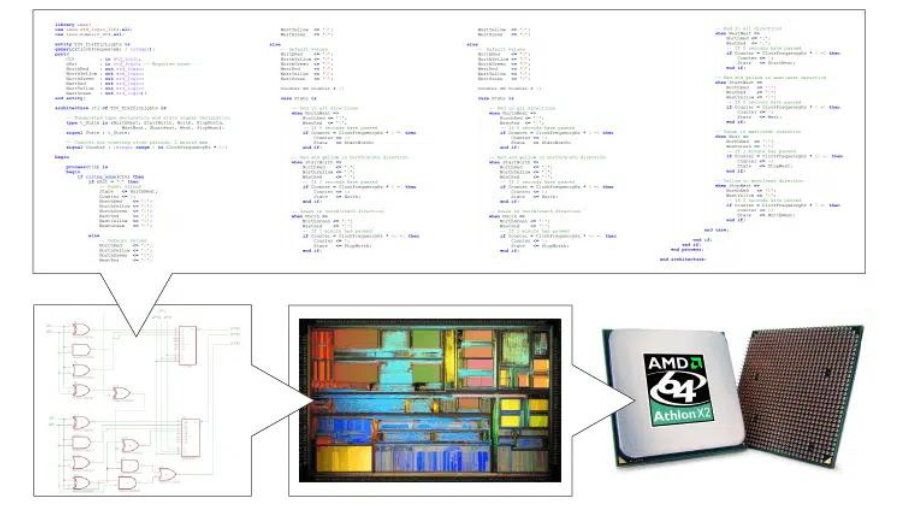
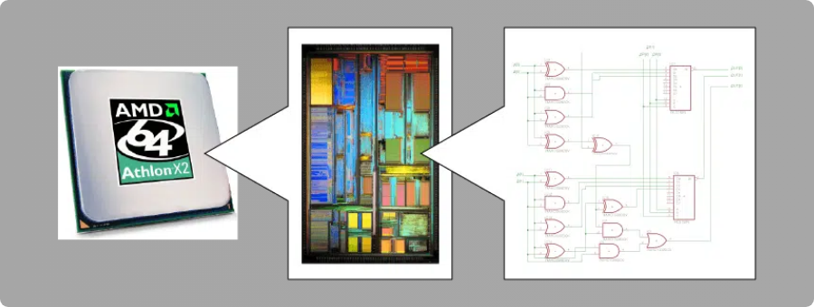

  

# Getting Started with VHDL

VHDL stands for `Very High Speed Integrated Circuit Hardware Description Language`, and it's a hardware description language used for designing physical, digital circuits. The word `hardware` refers to the computer hardware, and more specifically integrated circuits such as the CPU.

## VHDL Workflow:

The process of running VHDL code involves several steps:

**Synthesis:** After engineers write the code using a hardware description language, it is processed by a tool, `similar to a compiler`, to generate a synthesized circuit netlist. Netlists are made up of components and their connections. Components like resistors or transistors are listed, along with how their terminals (pins) are connected through specific signal paths called nets.

**Place and Route:** Here, the netlist is processed by a tool that maps the circuit to the physical resources of the target architecture, determining the placement of components and routing the connections between them.

## Used Tools:

To run and simulate VHDL code, you will need the following tools. Below are links to install them:

- **ModelSim:** A logic simulation tool - [Download link](https://www.intel.com/content/www/us/en/software-kit/660907/intel-quartus-prime-lite-edition-design-software-version-20-1-1-for-windows.html):

  - Select: **Individual Files**
  - Under **Intel® Quartus® Software**, download: **ModelSim-Intel® FPGA Edition (includes Starter Edition)**

- **Quartus Prime Lite:** An FPGA synthesis / implementation tool - [Download link](https://www.intel.com/content/www/us/en/software-kit/825278/intel-quartus-prime-lite-edition-design-software-version-23-1-1-for-windows.html):

  - Select: **Individual Files**
  - Under **Intel® Quartus® Software**, download: **Quartus® Prime (includes Nios II EDS)**

- **MAX10 Device Files:** MAX10 FPGA device information - [Download link](https://www.intel.com/content/www/us/en/software-kit/825278/intel-quartus-prime-lite-edition-design-software-version-23-1-1-for-windows.html):

  - Select: **Individual Files**
  - Under **Devices**, download: **MAX® 10 FPGA device support**

Place all the downloaded files in the same directory, then launch `Quartus Prime Lite` and `ModelSim` to begin your workflow.
